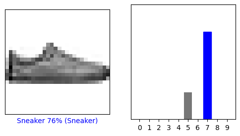

# Classification d'images par Deeplearning

> Vision appliquée pour la Robotique  
> Majeure ROBIA/ module IA Vision  
> LONCHAMBON Alexis - 5IRC
***
> Prise en main de Tensorflow

## Partie 1

### Question 1

> 1.1 Expliquez les points communs et différences entre Keras, Tensorflow, pytorch et Yolo Darknet

Keras est une API haut-niveau. Elle permet d'implémenter plusieurs backends comme Tensorflow, PaidML, Theano, CNTK... Facile a utiliser et a apprendre mais plus lente a cause de l'overhead.  

TensorFlow est un framework de bout-en bout pour utiliser les Réseaux de Neurones. Open-Source et fait par Google. TS est en général bas-niveau mais a un peu de haut-niveau.

PyTorch est comparable a TS. C'est un framework de deep-learning basé sur Torch, par Facebook. Assez facile a utiliser et déboguer.

Yolo Darknet est une librairie en C pour la classification d'images. YOLO pour "You Only Look Once".

> 1.2 On explicitera en particulier, ce qui est « statique » vs « dynamique »

On parle de statique et dynamique pour l'entrainement de modeles.  

- Les modeles statiques sont des entrainement offline qui s'opèrent une seule fois.
- Les modeles dynamiques sont des entrainement online où les données sont continuellement données au modèle pour un entrainement continu sur le long terme.

> 1.3 Le langage support utilisé

En général, tout se fait en Python (et c'est bien dommage). Certaines librairies sont portées en d'autres langages comme TensorFlow qui est disponible en C, C#, JS, etc...

> 1.4 Comment est décrit le réseau de neurones  (donner des exemples)

Il existe plusieurs types de réseaux de neurones en fonction de leur architecture et leur utilisation.  
Quelques Réseaux notables :

- Recurrent Neural Network (RNN)
- Variational Auto Encoder (VAE)
- Deep Convolutional Network (DCN)
- Generative Adversarial Network (GAN)

### Question 2

Prise en main de l’exemple suivant : [TensorFlow Colab](https://www.tensorflow.org/tutorials/keras/classification)

On commence par regarder et tester le code fournit sous google Collab

> 2.1 Donner la définition d’un neurone au sens informatique

Un neurone en informatique est une "unité de calcul" dans le réseau. En général c'est une fonction qui peut prendre un certain nombre d'inputs pour resortir un certain nombre d'outputs.

> 2.2 En quoi consiste la notion de couche dans les réseaux de neurones

La notion de couche permet d'extraire la représentation des données qui leur sont envoyées.

Pour etre plus précis, une couche représente une certaine opération a faire sur ses données d'entrée. Par exemple, une couche sera dédiée a réorganiser les données, ou multiplier chaque element en entrée par une valeur etc...

> 2.3 En quoi consiste une couche dans un réseau neurone

Une couche est un groupe de neurones agissant ensembles a une certaine profondeur du réseau. Il s'agit de différents neurones pouvant agir en parallele en prenant les inputs d'une couche précédente, les traiter et ensuite les donner a une potentielle couche suivante.

> 2.4 Quelles sont les différentes  couches généralement associés dans les réseaux de neurones (faire d’abord une  réponse rapide que vous compléterez jusqu au dernier TP au fur et à mesure ….)

On peut avoir une couche d'entrée avec les inputs du réseau, une couche de sortie qui donne le résultat et plusieurs couches "cachées qui servent a faire différents calculs dans le réseau de neurone.

> 2.5 Expliquer en détail le réseau sous-jacent de l’exemple

Dans notre exemple, on a un réseau a 3 couches :

- Une premiere couche va transformer notre image (une tableau de 28x28px) en tableau a une dimension (784 valeurs).
- Une seconde couche Dense va traiter notre trableau avec 128 neurones
- La troisieme va classifier les données en une série de 10 classes en leur donnant une valeur de probabilité avec donc 10 neurones.

> 2.6 Est ce habituelle ? Pouvez t on faire plus simple ?

Cette implémentation est déjà très simple avec 3 couches.

> 2.7 Quel type de modifications simplistes peut être faite sur le réseau et en particulier  sur les hyper paramètres.

Il est possible de modifier les parametres du réseau caché de traitement, augmenter le nombre de neurones ou ajouter une couche intermédiaire.

> 2.8 Relancer l’apprentissage en changeant ses paramètres, mettre en place un tableau montrant l’influence de ses paramètres.

```py
model = tf.keras.Sequential([
    tf.keras.layers.Flatten(input_shape=(28, 28)),
    tf.keras.layers.Dense(128, activation='selu'),
    tf.keras.layers.Dense(64, activation='selu'),
    tf.keras.layers.Dense(10)
])
```

ou

```py
model = tf.keras.Sequential([
    tf.keras.layers.Flatten(input_shape=(28, 28)),
    tf.keras.layers.Dense(256, activation='selu'),
    tf.keras.layers.Dense(10)
])
```

Mais ca a pas trop marché : les résultats sont tout le temps assez aléatoire.


> 2.9 Quelle est la fonction d’activation associée au modèle, tester avec d’autres fonctions d’activation. Quelles sont les performances obtenues.

```py
model = tf.keras.Sequential([
    tf.keras.layers.Flatten(input_shape=(28, 28)),
    tf.keras.layers.Dense(128, activation='gelu'),
    tf.keras.layers.Dense(64, activation='gelu'),
    tf.keras.layers.Dense(10)
])
```

Réussite critique !



Mais ca reste vraiment aléatoire. Chaque type d'activation a des résultats assez similaires.

### Question 3

On veut tester 10 images que vous créerez vous même ne partant d’image couleur trouvés sur internet et en les convertissant pour les mettre au format reconnu par « ..._model.predict ».

> 3.1 Quelle est ce format ? On passera par un fichier bmp en 28x28 puis on rajoutera au dossier sous google collab et on convertira directement pour l’usage dans predict  (quel est le code associé sous  google collab)

Toutes les images sont en noir et blanc (image de 28x28 en grayscale sur 8 bits : `Shape (28, 28, 1) uint8` ).  

> 3.2 Deposer ces images sur le e-campus  sous un format bmp 28X28 et déposer aussi l’orginal trouvé sur internet .
Est ce fait ?

Oui

> 3.3 Tester vos images, on affichera l’image et le résultat sous google collab sous la forme suivante :
Copier ici le resultat et le code specifique que vous avez écrit
Si rien ne marche essayer de comprendre pourquoi et trouver une solution pour valider votre processus en partant d’une image du dataset.

Apres beaucoup d'essais, on a réussi a avoir un résultat cohérent.  
On a remplacé le test_images et test_labels avec nos propres images et réutilisé le code du Notebook. On obtient des résultats assez aléatoires mais relativement corrects.


```py

def load_custom_img(path):
    # load img grayscale
    custom_image = tf.keras.utils.load_img(path,
                                            color_mode='grayscale',
                                            target_size=(28, 28))
    custom_image = tf.keras.utils.img_to_array(custom_image)    # convert to array
    custom_image = custom_image / 255.0                         # reduce to 0-1 values
    img = tf.squeeze(custom_image, axis=-1)                     # remove unneeded axis to get (28,28) shape
    return img


# make lists
images = list()
labels = list()

# add local images 
custom_image = load_custom_img("/content/IMG/Polo.bmp")
images.append(custom_image)
labels.append(6)

# [...]

custom_image = load_custom_img("/content/IMG/Adidas.bmp")
images.append(custom_image)
labels.append(7)

# convert lists to numpy arrays
custom_images = np.array(images)
custom_labels = np.array(labels)
```

The rest of the code is unchanged from the original code. We only swapped `test_images` to `custom_images`

### Question 4

(faire d’abord une  réponse rapide que vous compléterez jusqu au dernier TP au fur et à mesure ….)

> 4.1 Avez-vous des idées pour améliorer la structure du réseau ?

Pour le moment, nous n'avons pas de solution initiale pour améliorer le réseau mais quelques idées a explorer.  
Il serait possible d'ajouter des layers afin de détailler un peu mieux la logique ou lui donner plus de neurones.

Il faudrait également explorer d'autres types de layers pour voir s'il y a de meilleures combinations. (`Conv2D`, `MaxPooling2D`, ...)

> 4.2 Lesquels ?

Voir ci dessus

> 4.3  Tester pour voir si c’est mieux et conclure ?

Ben pour le moment, non. C'est vraiment nul.

Mais nous sommes confiant que nous trouverons un réseau neuronal plus performant.
