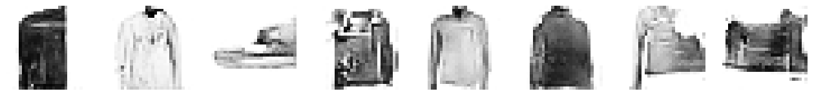
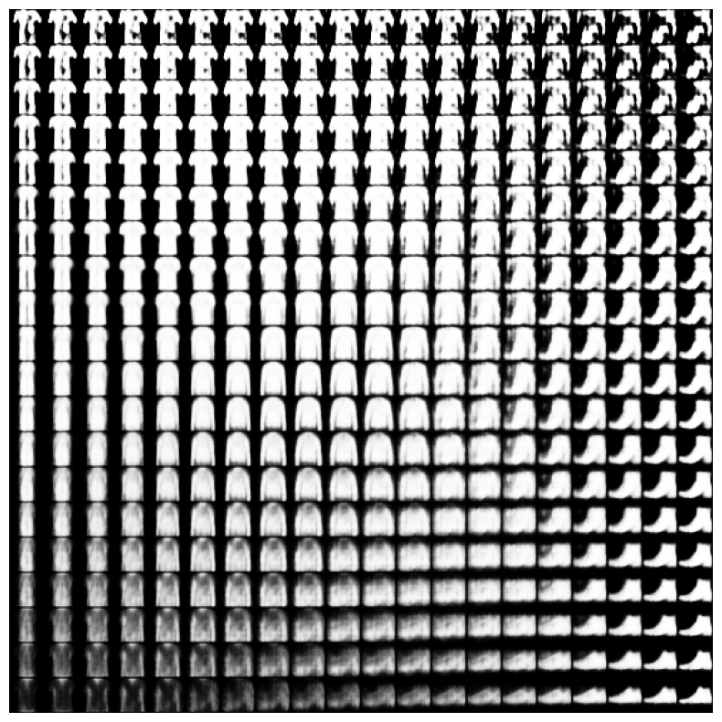

# Classification d'images par Deeplearning

> Vision appliquée pour la Robotique  
> Majeure ROBIA/ module IA Vision  
> LONCHAMBON Alexis - 5IRC
***
> Deep Generation

## Partie 4

### Question 1

On s’intéresse au réseau suivant

[Collab](https://colab.research.google.com/github/timsainb/tensorflow2-generative-models/blob/master/2.0-GAN-fashion-mnist.ipynb)

>1.a Mettre en œuvre le réseau.

>1.b Quelle est son objectif ?

Ce réseau est capable de générer des images a partir d'images déjà générées. Il est entrainé sur un Dataset et est capable de générer des images du même type.

>1.c Que pensez vous du résultats

Franchement ? Pas ouf.

>1.d Quelle est le nom d’une telle approche ? Expliciter le sens de l’architecture ?

Cette aprroche est un GAN (Generative Adversarial Network)

Il s'agit d'avoir un modele (encodeur) qui génère une image et un décodeur qui va vérifier que l'image correspond au dataset.

> 1.e  A quelle moment est utilisé le dataset.

Le dataset est utilisé a l'entrainement du modele apres avoir défini l'architecture du discriminateur et encodeur.

> 1.f Comment pourrait on mettre en œuvre un équivlent pour des visages ou des pizzas en utilisant la même architetcure

Il suffirait de modifier le dataset.

### Question 2

Même question pour le code suivant

[Collab](https://colab.research.google.com/github/tensorflow/docs/blob/master/site/en/tutorials/generative/cvae.ipynb)

>1.a Mettre en œuvre le réseau.

Done !

>1.b Quelle est son objectif ?

L'objectif est de mapper les images sources sur un espace de probabilités. Ainsi, reproduire des images du dataset et des variations.

>1.c Que pensez vous du résulltats

Chelou un peu ?

>1.d Quelle est le nom d’une telle approche ? Expliciter le sens de l’architecture ?

C'est un auto-encodeur probabiliste.

>1.e  A quel moment est utilisé le dataset.

le dataset est utilisé tout au début pour organiser chaque image dans le champ latent.

>1.f Comment pourrait-on mettre en œuvre un équivalent pour des visages ou des pizzas en utilisant la même architecture

Changer le dataset

### Question 3

> 3.a y  a-t-il une différence entre les deux approches

Oui

La premiere methode génère des images et ensuite vérifie que les images correspondent a son dataset.  
La seconde methode connait en quelques sortes comment varient les images du dataset pour en générer des variantes.

> 3.b essayer d’utiliser le dataset pokemon disponible sur kaggle pour generer des pokemons
